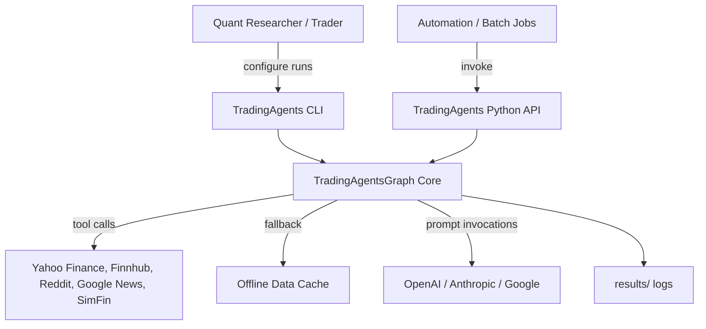
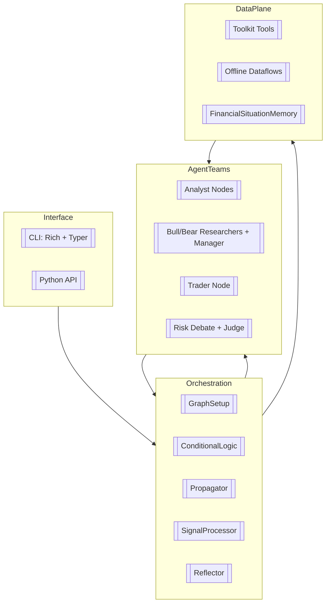
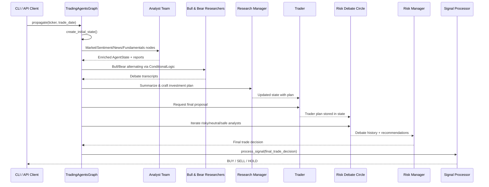

# System Design

## 1. Purpose and Capabilities
TradingAgents orchestrates a team of specialized LLM agents to perform research-driven equity trading analysis. The framework mirrors a buy-side firm structure: analysts source and synthesize signals, researchers debate positions, traders operationalize the plan, and a governance layer manages risk. The automation is built on LangGraph and LangChain primitives, letting the graph express agent interactions, tool usage, and stateful debates.

Key capabilities:
- Multi-role analysis spanning technicals, sentiment, news, and fundamentals.
- Debate-style reasoning with configurable rounds and memory-backed reflection.
- Risk management loop that challenges trade proposals before execution.
- CLI experience for interactive runs and package APIs for programmatic use.

## 2. System Context

The `TradingAgentsGraph` (`tradingagents/graph/trading_graph.py`) is the execution nucleus shared by both the CLI (`cli/main.py`) and direct library usage (`main.py`). External dependencies are abstracted behind the `Toolkit` and `dataflows` packages.

## 3. Architectural Layers

- **Interface layer**: Either the CLI (`cli/main.py`) or library consumers call `TradingAgentsGraph.propagate()`.
- **Orchestration layer**: Builds and runs the LangGraph state machine, manages recursion limits, reflection, and signal extraction.
- **Agent teams**: Each node is a partially applied function that consumes and emits `AgentState` objects (`tradingagents/agents/utils/agent_states.py`).
- **Data plane**: Tool invocations request live data; offline caches and vector memories provide continuity between runs.

## 4. Execution Flow

Conditional edges in `ConditionalLogic` decide when analysts stop calling tools, how many debate rounds execute, and when the flow reaches the judge.

## 5. State and Memory Management
The shared `AgentState` typed dict contains the latest reports, debate transcripts, and final decisions. Helper classes (`Propagator`, `SignalProcessor`) construct and interpret this state.

Long-lived learning happens via `FinancialSituationMemory` (`tradingagents/agents/utils/memory.py`), which:
- Embeds summarized situations through OpenAI embeddings (or Ollama when running locally).
- Stores them in a transient ChromaDB instance per role (bull, bear, trader, judges).
- Retrieves the closest recommendations to steer future prompts.

Reflection routines in `Reflector` append new lessons after each run, closing the learning loop.

## 6. Data Acquisition and Tooling
`Toolkit` (`tradingagents/agents/utils/agent_utils.py`) wraps both online APIs and offline cache lookups. The data flow rules are:
- **Online mode**: Agents call OpenAI functions to fetch data (e.g., `get_YFin_data_online`, `get_global_news_openai`).
- **Offline mode**: Agents fall back to curated datasets under `tradingagents/dataflows/` (e.g., Finnhub JSON exports, SimFin CSVs, Reddit scrapes).
- Calls route through `langgraph.prebuilt.ToolNode`, so tool outputs are appended to the message stream until the analyst stops requesting data.

The `dataflows/interface.py` module normalizes inputs (date windows, ticker symbols) and formats responses into LLM-friendly Markdown blocks.

## 7. Configuration and Extensibility
- Default settings live in `tradingagents/default_config.py`. Consumers can copy and mutate this dict before instantiating `TradingAgentsGraph`.
- `GraphSetup.setup_graph()` accepts the analyst roster, allowing narrower runs or experiments with custom nodes.
- To add an agent, implement a node factory that accepts an LLM and toolkit/memory dependency, then register it in `GraphSetup` together with an entry in the `Toolkit` if data access is needed.
- Conditional logic thresholds (`max_debate_rounds`, `max_risk_discuss_rounds`, recursion limits) are passed into `ConditionalLogic` and `Propagator` during graph construction.

## 8. Non-Functional Considerations
- **Latency & cost**: Runs invoke multiple LLM calls per agent and extensive tool usage; choose lighter models (`o4-mini`, `gpt-4.1-mini`) for testing.
- **Reproducibility**: With online tools enabled, outputs depend on live APIs; disable online mode for deterministic replay from cached data.
- **Statefulness**: ChromaDB collections are in-memory per process; persisting them requires swapping the `chromadb` client configuration.
- **Observability**: The CLI (`cli/main.py`) visualizes progress, but programmatic users should persist `TradingAgentsGraph.log_states_dict` if audit trails are required.

## 9. Known Gaps and Future Enhancements
- The default `data_dir` in `DEFAULT_CONFIG` is developer-specific and should be externalized via environment configuration for portability.
- Risk and research debate limits are hard-coded when `ConditionalLogic` is instantiated inside `TradingAgentsGraph`; exposing them as config entries would simplify tuning.
- Reflection outputs are stored but not yet reinjected into prompts across runs; wiring the reflection step into the workflow is on the roadmap.
- Automated testing around agent prompts is limited; contract tests for data formatting and state transitions would improve reliability.
