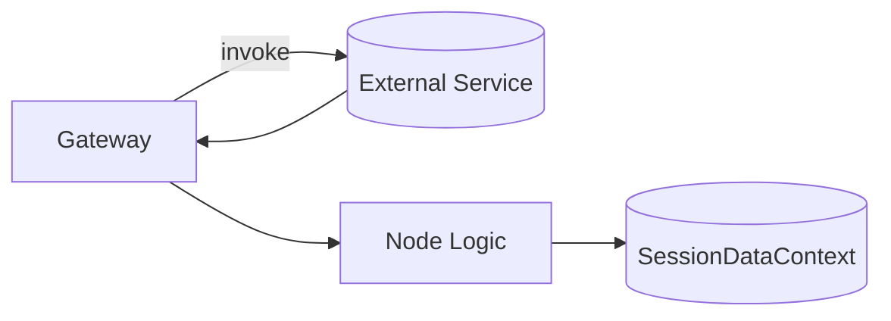

# Data Providers & Gateway

This guide covers the infrastructure components that supply raw and derived data to nodes.

## Components
- **ExternalApiGateway**: Mediates all outbound API calls (LLM providers, market data, news feeds). Standardizes retries, logging, and error handling.
- **Provider Adapters**: Thin wrappers for OpenAI, Anthropic, Google, Finnhub, Yahoo Finance, Reddit, SimFin, and offline caches.
- **DataFetchNodes**: Use the gateway to retrieve raw datasets during bootstrapping and publish them as `raw.*` artifacts.

## Data Flow

## Implementation Notes
- Keep adapters stateless; configuration (API keys, endpoints) injected via environment/config objects.
- Mock the gateway in tests to ensure deterministic outcomes.
- Support offline modes by routing to cached datasets.
- Implementation scaffolding lives in `tradingagents/infrastructure/external/`.
- Raw data bootstrapping is implemented in `tradingagents/application/bootstrap/bootstrapper.py` using nodes from `tradingagents/application/nodes/data_fetch.py`.

## Related Documents
- [Master Plan](../implementation/master-plan.md)
- [Modernization Plan](../implementation/modernization-plan.md)
- [Final Architecture](../new-architecture/final-architecture.md)
