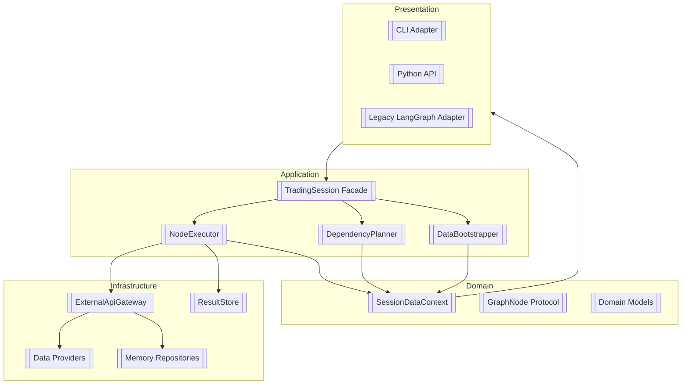
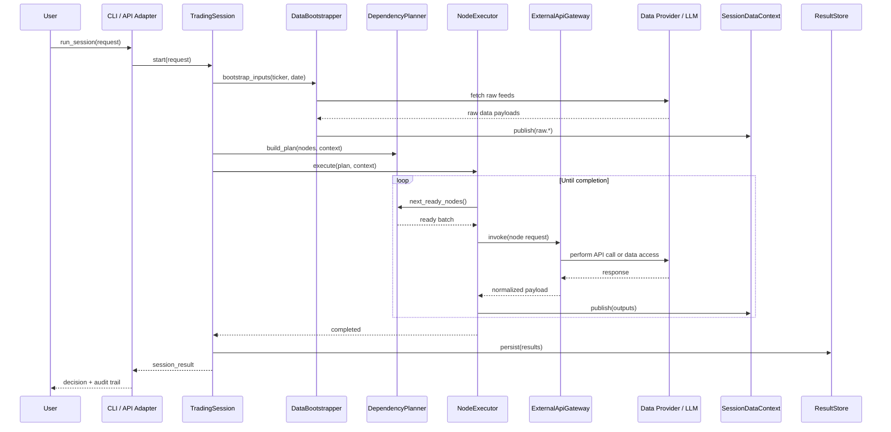

# TradingAgents Next-Generation Architecture

## 1. Purpose
This document presents the target architecture for TradingAgents after the modernization effort. It explains the layered structure, shared contracts, and runtime coordination patterns that replace the legacy LangGraph-centric orchestration. The goal is to deliver maintainability, testability, and extensibility while protecting existing workflows.

## 2. Layered View

- **Presentation**: Thin adapters (CLI, API, optional LangGraph compatibility) interact only with the `TradingSession` facade.
- **Application**: Orchestrates workloads using dependency-aware planning and execution, starting with a deterministic bootstrap of raw data.
- **Domain**: Provides immutable models, context access helpers, and node descriptors to decouple business logic from implementation details.
- **Infrastructure**: Hosts provider adapters, the shared `ExternalApiGateway`, memory stores, and persistence.

## 3. Node Taxonomy
All runtime units conform to the `GraphNode` protocol (`id`, `node_kind`, `requires`, `produces`, `execute(context, gateway)`).

| Node Kind       | Responsibilities | Example Outputs | Failure Handling |
|-----------------|------------------|-----------------|------------------|
| `data_fetch`    | Retrieve raw datasets via providers and seed the context | `raw.market`, `raw.news` | Raise `BootstrapFailure` to halt early |
| `analysis`      | Transform raw feeds into analyst reports using LLM reasoning | `analysis.market_report` | Publish partial artifacts, degrade gracefully |
| `aggregation`   | Combine multiple artifacts into synthesized plans | `analysis.market_summary` | Retry logic via executor |
| `debate`        | Coordinate structured debates (bull/bear, risk trio) | `debate.summary` | Store debate transcripts for auditing |
| `risk`          | Evaluate exposure and produce governance assessments | `risk.assessment` | Escalate to fallback policies |
| `decision`      | Produce final BUY/SELL/HOLD recommendation | `decision.proposal` | Mark session failed if undecided |
| `report`        | Generate external-facing summaries, logs, or audit trails | `reports.session_markdown` | Non-blocking, flagged if missing |

## 4. Execution Flow

### Planner & Executor Rules
- The planner validates DAG integrity, rejects cycles, and ensures every dependency resolves to a produced artifact.
- The executor records metrics per node run, captures retries, and surfaces structured errors for observability.
- Debug mode streams intermediate node outputs for incremental UI updates.

## 5. Session Data Context
`SessionDataContext` is an immutable-friendly container for artifacts. Key behaviours:
- `require(key)` returns data when available; raises `MissingArtifactError` otherwise.
- `publish(key, value)` is idempotent per session; duplicate writes are logged.
- `is_ready(requirements)` allows the planner to schedule nodes only when inputs exist.
- Namespaced keys (`raw.*`, `analysis.*`, `debate.*`) standardize sharing across teams.

## 6. External API Gateway
The `ExternalApiGateway` abstracts outbound communication:
- **LLM Calls**: Normalizes prompts, handles retries/backoff, and tracks token usage across providers.
- **Data Providers**: Wraps Yahoo Finance, Finnhub, Reddit, SimFin, and internal stores with consistent error semantics.
- **Circuit Breaking**: Central place to introduce rate limiting, caching, or fallbacks without touching business logic.
- **Testing**: Tests mock the gateway to avoid real network calls, enabling fast deterministic suites.

## 7. Data Lifecycle
1. **Bootstrap**: All raw feeds fetched once via data-fetch nodes. Fail fast on missing critical datasets.
2. **Analysis**: Analysts translate raw data into structured reports, optionally enriching with memory hints.
3. **Debate & Risk**: Debaters and risk agents critique proposals, storing transcripts for audit.
4. **Decision**: Trader and risk judge nodes consolidate insights into an actionable trade decision.
5. **Reporting**: Summary nodes render markdown/JSON output for CLI and downstream automation.

## 8. Testing & Observability
- End-to-end suites mock the gateway and providers to capture regressions across node interactions.
- Feature flags allow dual-running legacy LangGraph and new executor for comparison during rollout.
- Structured logging from executor and gateway feeds metrics dashboards (duration, retries, cost estimates).
- Session artifacts (context snapshots, node execution traces) stored in the `ResultStore` for auditing.

## 9. Extensibility Guidelines
- Add new capabilities by implementing a `GraphNode`, registering its dependencies, and exposing outputs via the context.
- Inject experiment-specific providers by supplying alternative adapters to the gateway during session construction.
- Compose custom pipelines by altering node specs while reusing shared bootstrapper and executor infrastructure.
- Keep domain entities pure; infrastructure-specific logic belongs in adapters or gateway interceptors.

## 10. Roadmap Alignment
This architecture underpins the modernization plan outlined in `../implementation/modernization-plan.md`. Each milestone incrementally migrates legacy components while keeping the new contracts stable and test-backed.
