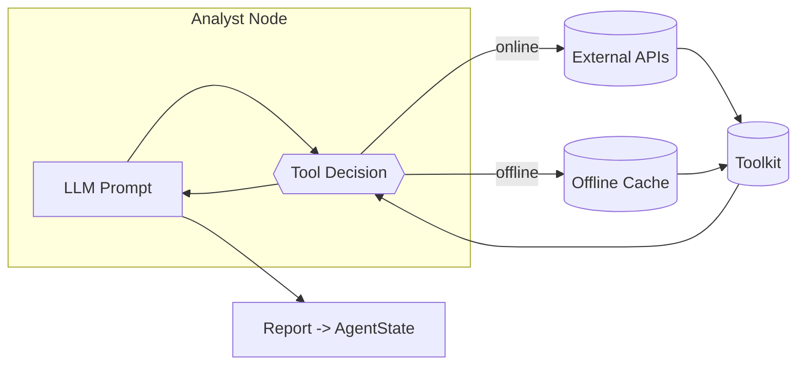

# Analyst Team

The analyst layer ingests raw market signals and transforms them into structured reports that seed downstream debates. Each analyst node is a LangGraph-compatible callable created in `tradingagents/agents/analysts/` and shares a common shape:

1. Build a role-specific system prompt.
2. Bind the permitted tools from the shared `Toolkit`.
3. Invoke the LLM with the conversation history stored in `AgentState.messages`.
4. Append the generated report back into `AgentState`.

## Roles at a Glance
| Role | Factory | Primary Data Sources | Output Field |
|------|---------|----------------------|--------------|
| Market Analyst | `create_market_analyst` | Yahoo Finance OHLCV, Stockstats indicators | `market_report` |
| Social Media Analyst | `create_social_media_analyst` | Reddit company threads, OpenAI-powered sentiment feeds | `sentiment_report` |
| News Analyst | `create_news_analyst` | Google News, Finnhub archives, Reddit global news | `news_report` |
| Fundamentals Analyst | `create_fundamentals_analyst` | Finnhub insider data, SimFin financial statements, custom OpenAI tool | `fundamentals_report` |

All analysts conclude with a Markdown summary that downstream roles reuse verbatim.

## Tool Selection and Control Flow
Each analyst chooses tool variants based on `Toolkit.config['online_tools']`. When set to `True`, network-bound functions collect fresh data; otherwise, they fall back to cached datasets under `tradingagents/dataflows/`.

Tool invocations are mediated by LangGraph `ToolNode`s created in `_create_tool_nodes()` inside `tradingagents/graph/trading_graph.py`. `ConditionalLogic.should_continue_*` inspects the last LLM message: if a tool call is present, execution loops through `ToolNode` to fetch data; otherwise, the node emits its final report and the workflow advances.

## Extending the Analyst Layer
- Add a new tool to `Toolkit` with the `@tool` decorator so LangGraph can route invocations.
- Create a node factory mirroring the existing analysts: bind the tool subset, craft role prompts, and update the returned state dict with a new report key.
- Register the node in `GraphSetup.setup_graph()` by adding it to `analyst_nodes` and `conditional_logic`.
- Update `AgentState` (`tradingagents/agents/utils/agent_states.py`) with the new report field so downstream roles can consume it.
