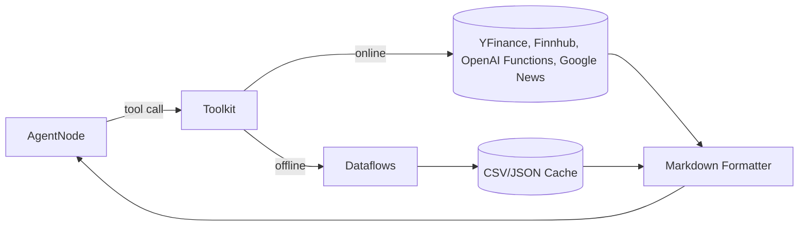

# Data Platform & Tooling

TradingAgents separates data acquisition from agent logic so that research nodes focus on reasoning while the `Toolkit` and `dataflows` packages handle ingress, formatting, and caching.

## Toolkit Overview
`Toolkit` (`tradingagents/agents/utils/agent_utils.py`) exposes `@tool`-decorated functions consumable by LangGraph. Each tool encapsulates:
- Input annotations used by LangChain to validate structured tool calls.
- A thin adapter into the `dataflows.interface` module or a live API.
- Markdown-friendly string outputs to plug directly into prompts.

The toolkit is instantiated once per `TradingAgentsGraph` and shared across agents. Configuration merges `DEFAULT_CONFIG` with user overrides via `Toolkit.update_config()`.

## Offline vs Online Modes
`DEFAULT_CONFIG['online_tools']` determines which data plane to use.
- **Online**: Functions such as `get_YFin_data_online`, `get_global_news_openai`, or `get_fundamentals_openai` query remote APIs (OpenAI routes the heavier summarization workloads).
- **Offline**: Toolkit redirects to cached datasets stored under `tradingagents/dataflows/data_cache/` (written to on demand) or the curated archive referenced by `DEFAULT_CONFIG['data_dir']`.

## Dataflows Package
Key modules under `tradingagents/dataflows/` include:
- `interface.py`: Public entry points that orchestrate date math, batching, and formatting for each provider. Functions like `get_finnhub_news` or `get_reddit_company_news` leverage helper utilities and guarantee consistent Markdown formatting.
- `yfin_utils.py`, `stockstats_utils.py`: Fetch and enrich market data (e.g., compute technical indicators before returning a report).
- `finnhub_utils.py`, `reddit_utils.py`, `googlenews_utils.py`: Read from exported datasets and support thread-safe, multi-day aggregation.
- `config.py`: Stores runtime config (`DATA_DIR`) and responds to updates from `TradingAgentsGraph` via `set_config()`.

## Memory Storage
`FinancialSituationMemory` (`tradingagents/agents/utils/memory.py`) functions as a lightweight experience replay buffer:
- Embeddings are computed using OpenAI's `text-embedding-3-small` or Ollama's `nomic-embed-text` depending on `backend_url`.
- Recommendations are stored in an in-memory ChromaDB collection per role.
- `get_memories()` returns the best matches for prompt injection and indicates similarity scores for future weighting.

Persisting memories across runs requires reconfiguring the Chroma client to use a file-backed storage provider.

## Reliability Concerns
- Service limits (API quotas, tool failures) bubble up as exceptions from Toolkit calls. Consider wrapping nodes with retry logic if productionizing the framework.
- Some offline datasets referenced in `DEFAULT_CONFIG['data_dir']` are not bundled; deployments must provision the directory or override the path.
- Tool sanitization (e.g., verifying tickers, clamping lookback windows) is minimal today; additional guards can be added in `dataflows/interface.py`.
