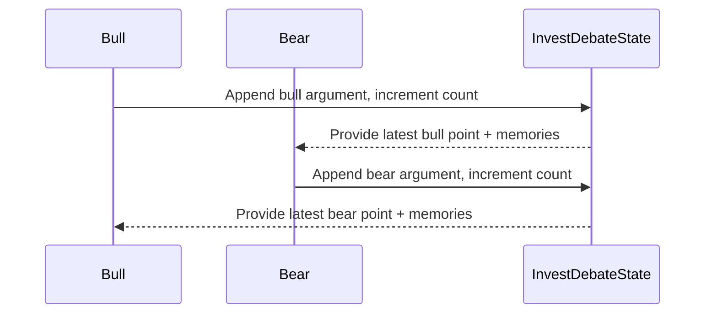

# Research & Trading Pipeline

Once analyst reports are populated, the research pipeline debates the thesis, distills a plan, and hands it to the trader for execution framing. The implementation resides under `tradingagents/agents/researchers/`, `tradingagents/agents/managers/`, and `tradingagents/agents/trader/`.

## Debate Loop
- **Bull and Bear Researchers** alternate turns (`create_bull_researcher`, `create_bear_researcher`) while `ConditionalLogic.should_continue_debate()` keeps count via `InvestDebateState['count']`.
- Each researcher pulls role-specific memories from `FinancialSituationMemory` to learn from prior scenarios and confront the opponent's argument with direct rebuttals.
- Debate transcripts are accumulated in `InvestDebateState['history']`, providing the manager with full context.

The debate stops after `2 * max_debate_rounds` turns (default `3` back-and-forths), at which point the Research Manager takes over.

## Research Manager Responsibilities
The manager (`create_research_manager`) synthesizes debate outcomes along with analyst reports, plus lessons retrieved from memory. The manager writes two state fields:
- `investment_debate_state['judge_decision']` – narrative justification for the chosen stance.
- `investment_plan` – structured plan the trader will refine.

Prompt design emphasizes decisive recommendations and explicit learning from past mistakes.

## Trader Node
The trader (`create_trader`) treats the manager's plan as input, retrieves the most similar historical memories, and issues a final narrative ending with `FINAL TRANSACTION PROPOSAL: **BUY/HOLD/SELL**`. The entire response is stored as `trader_investment_plan` and later parsed by the signal processor to extract the canonical BUY/SELL/HOLD decision.

## Reflection Hooks
Although not wired into the runtime loop yet, `tradingagents/graph/reflection.py` defines helpers for post-run analysis. Each method takes the final state, PnL feedback, and the relevant role memory to append new lessons. The design allows asynchronous reflection jobs to update the same ChromaDB collections leveraged during debates.

## Extension Checklist
To modify or add stages in this pipeline:
1. Extend `InvestDebateState` or `AgentState` with new fields.
2. Implement the node factory with persistent memory access if needed.
3. Update `GraphSetup.setup_graph()` to insert the node and connect edges.
4. Adjust `ConditionalLogic.should_continue_debate()` if the turn-taking rules change.

This keeps the debate logic declarative while preserving introspection via the shared state object.
