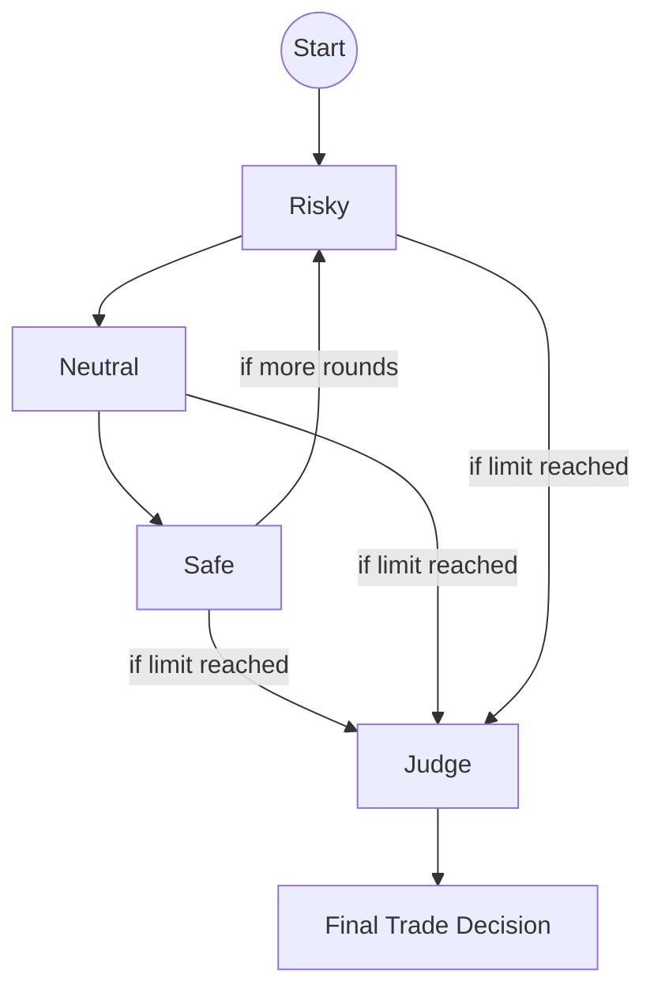

# Risk Management and Governance

The risk layer mirrors an investment committee that challenges the trader's proposal before producing a portfolio-ready decision. Code for this stage resides in `tradingagents/agents/risk_mgmt/` and `tradingagents/agents/managers/risk_manager.py`.

## Participants
| Node | Factory | Perspective | Key State Fields |
|------|---------|-------------|------------------|
| Risky Analyst | `create_risky_debator` | Aggressively defends upside, critiques conservative voices. | `risk_debate_state['risky_history']`, `'current_risky_response'` |
| Neutral Analyst | `create_neutral_debator` | Balances upside/downside, emphasizes sustainability. | `risk_debate_state['neutral_history']`, `'current_neutral_response'` |
| Safe Analyst | `create_safe_debator` | Protects assets, spotlights lurking threats. | `risk_debate_state['safe_history']`, `'current_safe_response'` |
| Risk Judge | `create_risk_manager` | Issues the final Buy/Sell/Hold decision and refines the trader's plan. | `risk_debate_state['judge_decision']`, `final_trade_decision` |

All participants inspect the trader's proposal (`trader_investment_plan`) plus the four analyst reports to frame their arguments.

## Debate Mechanics

`ConditionalLogic.should_continue_risk_analysis()` cycles between Risky → Safe → Neutral analysts until `risk_debate_state['count']` reaches `3 * max_risk_discuss_rounds` (default: three full turns). Each node appends its argument to the debate history and marks itself as the latest speaker. Messages include direct rebuttals to peers, encouraging adversarial dialogue rather than isolated commentary.

## Judge Output and Signal Processing
The Risk Judge leverages role-specific memories (`risk_manager_memory`) to avoid past mistakes, rewrites the trader’s plan if necessary, and stores the narrative decision in `final_trade_decision`. The `SignalProcessor` (`tradingagents/graph/signal_processing.py`) subsequently reduces this narrative to `BUY`, `SELL`, or `HOLD` for downstream automation.

## Governance Considerations
- **Auditability**: The full debate transcript is captured in `risk_debate_state['history']` and persisted in `TradingAgentsGraph.log_states_dict` for every run.
- **Override hooks**: Downstream systems can override or post-process `final_trade_decision` before acting, but the architecture encourages keeping governance upstream in the graph.
- **Extensibility**: Additional perspectives (e.g., compliance, portfolio construction) can plug in by augmenting `RiskDebateState` and inserting new nodes prior to the judge.
