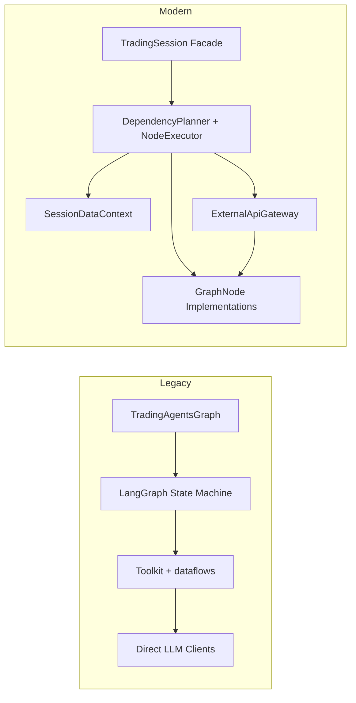

# Legacy vs Modern TradingAgents Architecture

## 1. Motivation
The original LangGraph implementation successfully shipped a working multi-agent trading workflow but accumulated technical debt: tight coupling between orchestration and infrastructure, limited testability, and costly incremental changes. The modern architecture reduces these friction points by introducing clear layering, shared contracts, and deterministic bootstrapping.

## 2. Executive Summary
- **Why change?** Accelerate feature delivery, simplify onboarding, and ensure reliability through automated testing.
- **What changes?** Replace the monolithic `TradingAgentsGraph` orchestration with modular nodes coordinated by a planner/executor and powered by a shared data context.
- **What remains?** Core agent prompts, CLI experience, and decision logic stay intact while gaining better composability.

## 3. Architectural Contrast

| Concern | Legacy Approach | Modern Solution | Benefit |
|---------|-----------------|-----------------|---------|
| Orchestration | Single class configuring and running LangGraph | Planner + executor with explicit DAG | Easier reasoning, smaller units |
| Data Access | Toolkit helper functions calling interfaces directly | Bootstrapped providers storing raw data in context | Fail-fast, deterministic inputs |
| API Calls | Agents invoke SDKs ad hoc | Central `ExternalApiGateway` mediates all calls | Uniform retries, test mocking |
| State Sharing | Implicit via shared dict mutated by nodes | Namespaced keys in `SessionDataContext` | Declarative dependencies |
| Testing | Difficult to mock Graph + tools | Gateway/context fixtures enable e2e coverage | Reliable regression guard |
| Extensibility | Adding a role means editing Toolkit, Graph setup, conditional logic | Implement new `GraphNode` and register spec | Lower change surface |
| Observability | Limited visibility into internal node progress | Executor logs node lifecycle, gateway tracks calls | Better ops insight |

## 4. Benefits & Impact
- **Developer Productivity**: Smaller, focused components reduce merge conflicts and speed up reviews.
- **Reliability**: Deterministic bootstrap ensures missing data is caught before LLM reasoning, preventing silent degradations.
- **Cost Control**: Gateway centralizes metering, enabling shared throttling or caching strategies.
- **Compliance**: Context snapshots and executor logs produce clear audit trails of how each decision was made.

## 5. Migration Considerations
1. **Test Safety Net**: Maintain the mocked e2e suite (`pytest -m e2e`) and expand scenarios as nodes migrate.
2. **Feature Flags**: Run legacy and modern runtimes in parallel during the migration to compare outputs.
3. **Gradual Node Porting**: Move agents one at a time into `GraphNode` implementations, leaving legacy nodes untouched until ready.
4. **Config Compatibility**: Preserve existing config keys; translate them into node specs during session construction.
5. **Training & Docs**: Provide example node implementations and update contributor guides to explain context and gateway usage.

## 6. Risk Mitigation
- **Behavioural Drift**: Compare decisions between runtimes and log discrepancies for investigation.
- **Performance Regression**: Benchmark node execution and adjust planner batching or caching policies as needed.
- **Operational Complexity**: Automate deployment of new components (gateway, planner) with infrastructure-as-code templates.
- **Stakeholder Alignment**: Schedule demos after each modernization milestone to maintain confidence and gather feedback.

## 7. Recommendation
Adopt the modern architecture in phases aligned with the modernization plan. The initial investment in new abstractions and tests is offset by long-term velocity, reliability, and the ability to iterate on advanced features (strategy simulation, live trading hooks, explainability) without rewriting core orchestration.
