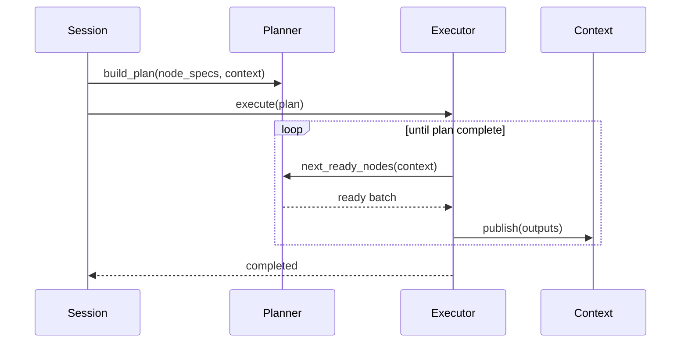

# Session Orchestration

This guide explains the coordination responsibilities of the application-layer components: `TradingSession`, `DependencyPlanner`, and `NodeExecutor`.

## Responsibilities
- **TradingSession**: Entry point for presentation layers. Sets up configuration, invokes the bootstrapper, builds the execution plan, and returns results.
- **DependencyPlanner**: Converts registered `NodeSpec` instances into an executable DAG, performing cycle detection and readiness checks using `SessionDataContext.is_ready()`.
- **NodeExecutor**: Runs nodes while handling retries, metrics, and error escalation. Publishes node outputs back into the context.

## Key Interactions

## Extension Guidelines
- Add new nodes by defining their `NodeSpec` and registering with the planner.
- Use feature flags to swap execution engines if required (e.g., legacy LangGraph vs new runtime).
- Capture execution metrics in the executor to support observability initiatives.
- Runtime scaffolding lives in `tradingagents/application/` (`planner.py`, `executor.py`, `session.py`).

## Related Documents
- [Master Plan](../implementation/master-plan.md)
- [Final Architecture](../new-architecture/final-architecture.md)
